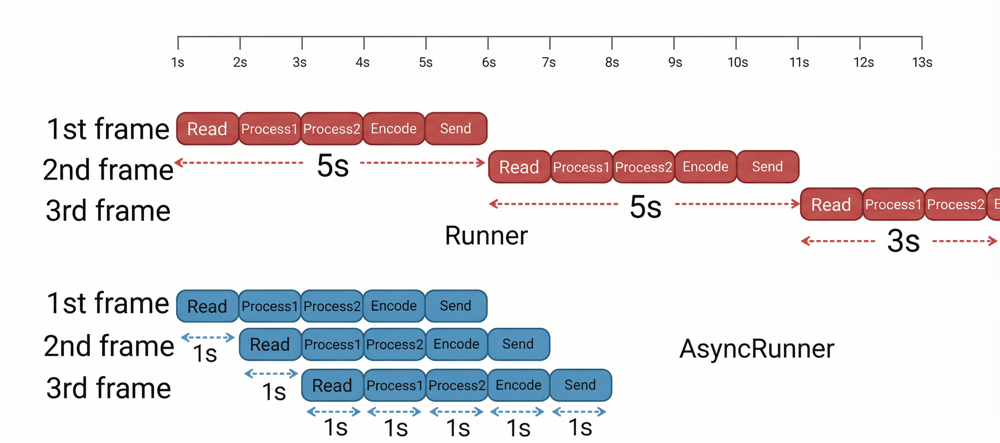

<p align="center">
  
</p>

# AudioStream

一个面向**音频流式处理**的 Rust 库，并通过 PyO3 暴露给 Python 使用：你可以把 **PCM（numpy）** 按 chunk 推给 `Encoder`，拿到 **编码后的 frame(bytes)**；或把 **编码帧(bytes)** 推给 `Decoder` 按 chunk 取回 **PCM（numpy）**。

目前 Python 侧最常用的场景是：

- **Python 生成/读取 PCM → 编码成 MP3/AAC 帧 → 通过网络推流**
- **Python/网络接收 MP3/AAC 帧 → 解码成 PCM → 做进一步处理/落盘**

> 说明：MP3/AAC 编码/解码通常依赖 `ffmpeg` feature（见下文安装方式）。

---

## 功能概览

- **Python API（PyO3）**：`Encoder` / `Decoder`
- **输入/输出**：
  - **Encoder**：`put_frame(pcm_numpy)` → `get_frame() -> bytes`
  - **Decoder**：`put_frame(frame_bytes)` → `get_frame() -> pcm_numpy`
- **Chunk 语义**：
  - 内部会把输入缓存到 FIFO，累计到 `chunk_samples` 才会产出一个 output frame
  - `get_frame(force=True)` 会在结束时尽可能把残留数据 flush 出来（包含对底层 codec 的 EOF flush）

---

## 依赖与构建（Python）

**注意⚠️：需要先安装FFMPEG！！！！！**

**否则 MP3/AAC encoder 会报需要 ffmpeg**

在项目根目录：

```bash
python -m pip install -U maturin numpy
maturin develop -F python -F ffmpeg
```

安装后 Python 侧可：

```python
import pyaudiostream as ast
```

---

## Python API 快速示例

### Encoder（PCM → 编码帧 bytes）

```python
import numpy as np
import pyaudiostream as ast

fmt = ast.AudioFormat(sample_rate=48000, channels=2, sample_type="f32", planar=True)
cfg = ast.Mp3EncoderConfig(fmt, chunk_samples=1152, bitrate=128_000)
enc = ast.Encoder("mp3", cfg)

pcm = np.zeros((2, 1152), dtype=np.float32)  # (channels, samples)
enc.put_frame(pcm)

pkt = enc.get_frame()
if pkt is not None:
    assert isinstance(pkt, (bytes, bytearray))

# 结束时建议 flush
while True:
    last = enc.get_frame(force=True)
    if last is None:
        break
```

### Decoder（编码帧 bytes → PCM numpy）

```python
import pyaudiostream as ast

cfg = ast.Mp3DecoderConfig(chunk_samples=1024, packet_time_base_den=48000)
dec = ast.Decoder("mp3", cfg)

dec.put_frame(b"...mp3 bytes...") # A Frame
pcm = dec.get_frame()
if pcm is not None:
    # numpy ndarray, shape=(channels, samples)
    print(pcm.shape, pcm.dtype)
```

---

## Example 1：`example/server.py`（Python 编码推流 → 浏览器解码流式播放）

这个示例包含三种模式，覆盖完整链路：

- **server**：提供网页 + WebSocket 广播；同时开一个 TCP ingest 端口接收“按帧”推送
- **sender**：使用 `pyaudiostream` 从 PCM（wav 或正弦）编码成 MP3/AAC 帧，按 framing 推给 ingest
- **demo**：同一进程里同时跑 server + sender（方便一条命令自测）

### 安装依赖

```bash
python -m pip install -U aiohttp
```

（并确保你已 `maturin develop -F python -F ffmpeg`）

### 一条命令自测（推荐）

```bash
python example/server.py --mode demo --codec mp3
```

浏览器打开：`http://127.0.0.1:23456`，点击“开始播放”。

### 分开跑（server / sender）

启动 server（HTTP+WS + TCP ingest）：

```bash
python example/server.py --mode server --codec mp3 --http-port 23456 --ingest-port 23457
```

启动 sender（从 wav 编码并推送）：

```bash
python example/server.py --mode sender --codec mp3 --host 127.0.0.1 --ingest-port 23457 --wav "/abs/path/to/input.wav" --seconds 0
```

#### 关键参数说明

- `--wav`
  - 目前示例要求 **16-bit PCM WAV**（sampwidth=2）
  - 且 wav 的 **采样率/声道数** 要和 `--sample-rate/--channels` 一致，否则会报错（避免“音调变高/变低”）
- `--chunk-samples`
  - PCM chunk 大小；越小延迟越低，但编码器/浏览器端可能更容易 buffer underrun
  - MP3 常见每声道 1152 samples（示例默认 1152）
  - AAC 常见为 1024

### 浏览器端说明

- **MP3**：使用 MSE（MediaSource）`audio/mpeg` 流式 append，兼容性最好
- **AAC(ADTS)**：不同浏览器对 `audio/aac` 的 MSE 支持不一致；建议优先用 MP3 验证链路

## 框架设计：AudioFlowModel

AudioFlowModel 是作者针对 Audio 的**流式计算（streaming computation）**设计的抽象层：它将持续到达的音频数据视为一条“流”，将编码、解码、DSP 处理等模块视为可组合的“算子”（Operator），通过标准化的协议构建出灵活的音频处理链路。

### 1. 核心设计理念

我们采用 **流式数据流（Dataflow）** 模型来统一描述音频处理过程：

* **流（Stream）**：数据在时间轴上的持续流动。在本项目中，流的载体（Payload）被严格类型化为两类 `NodeBuffer`：
* `PCM`：原始音频帧 (`AudioFrame`)
* `Packet`：编码后的数据包 (`CodecPacket`)

* **算子（Operator/Node）**：对流进行变换的计算单元。算子是有状态的（Stateful），可能包含编码器延迟、滤波器状态或内部缓存。
* **组合（Composition）**：算子之间遵循统一的输入输出协议，可以像积木一样串联，形成端到端的处理管线。

### 2. 组件架构

#### 2.1 Codec (核心算子)

这是音频处理的原子计算单元，直接作用于数据内容。

* **Encoder**：接收 PCM 输入，维持内部状态（如 Lookahead、Bit Reservoir），产出编码包。 (将音频信号压缩为比特流 `PCM -> CodecPacket`)
* **Decoder**：接收编码包输入，产出 PCM 音频。 (将比特流还原为音频信号 `CodecPacket -> PCM`)
* **Processor**：PCM 到 PCM 的变换。 (在时域上对音频信号进行处理，如增益、混音、重采样)
* *特殊实现* `IdentityProcessor`：一个“直通”算子 (`id: PCM -> PCM`)，不做任何修改地透传数据。常用于占位、链路测试或接口对齐。

#### 2.2 IO (源与汇)

负责将计算图连接到外部世界：

* **AudioReader (Source)**：流的**生产者**。负责从外部（文件、网络流、设备）读取数据，并将其转换为系统内的 `PCM` 或 `Packet` 流引入计算图。
* **AudioWriter (Sink)**：流的**消费者**。负责接收计算图输出的 `PCM` 或 `Packet`，并将其写入外部存储或发送至网络/声卡。

#### 2.3 Node (节点封装层)

`Node` 是对上述 Codec 和 IO 的标准化封装，目的是让不同的算子能够被 Pipeline 统一调度。它定义了流式处理的生命周期与交互协议：

* **协议（Push/Pull）**：外部向节点 Push 数据，从节点 Pull 结果。
* **背压（Backpressure）**：
* `Again`：当节点需要更多输入才能产生输出（例如编码器缓存未满），或输出暂时不可用时，返回此信号让调度器稍后重试。

* **生命周期（EOF & Flush）**：
* 当输入流结束时，通过 Push `None` 触发 **Flush** 操作，强制节点排空内部所有残留缓存。
* 当 Flush 完成且无更多输出时，返回 `Eof`。

**实现形态：**

* **DynNode (动态)**：使用 `NodeBuffer` 枚举进行类型擦除，允许通过 `Vec<Box<dyn DynNode>>` 在运行时动态组装任意复杂的链路（Python暴露这个接口）。
* **StaticNode (静态)**：利用 Rust 泛型系统在编译期确定类型，提供更强的类型安全和更少的运行时开销（Python接口不能用！）。
* *特殊实现* `IdentityNode`：节点层的“直通管”。它将输入 Buffer 所有权原样转移到输出（Zero-copy move）。常用于构建测试脚手架，验证 Runner 的驱动逻辑和背压传播机制。

#### 2.4 Pipeline (管线)

Pipeline 是对“节点组合”的抽象。它将一组 `Node` 按顺序连接（Chaining），自动处理节点间的数据传递。

典型链路示例：

```text
[Source] -> PCM --(Processor)--> PCM --(Encoder)--> Packet -> [Sink]

```

或者：

```text
[Source] -> Packet --(Decoder)--> PCM --(Processor)--> PCM -> [Sink]

```

* **AsyncPipeline**：专为异步环境（Tokio）设计的管线。它通常将管线拆分为 Producer（输入端）和 Consumer（输出端），支持非阻塞的 Push/Pull，便于在多任务环境中并行驱动。

也就是说，Pipeline必须有个输入和输出，但是输入输出可以是`PCM` 或 `Packet`（Runner可以不用，但需要指定Source和Sink）

#### 2.5 Runner (调度器)

Runner 是赋予静态计算图“生命”的执行引擎。它负责驱动整个 Pipeline 运转：

1. 从 Source 读取数据并 Push 进 Pipeline。
2. 持续 Pull Pipeline 的输出并写入 Sink。
3. 正确处理 `Again`（等待/让出时间片）。
4. 在输入结束时，负责传播 Flush 信号，直到所有节点处理完毕 (`Eof`)。

* **AsyncRunner**：Runner 的异步实现。它将计算逻辑与底层 I/O（如网络 Ingest、WebSocket 广播、文件读写）的异步特性完美结合，构建端到端的实时流式处理应用。

调度方式可参考下图
